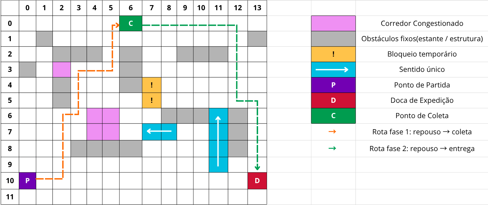

# Planejamento de Rotas de AGVs em Centro de Distribuição Automatizado

## Problema
### Contexto
Centros de distribuição modernos dependem cada vez mais de veículos autônomos guiados, os chamados AGVs, para movimentar mercadorias entre áreas de armazenamento, separação e expedição. Em operações desse tipo, atrasos, gargalos e escolhas ruins de rota podem comprometer a produtividade de todo o sistema logístico.

O ambiente interno de um centro de distribuição não é homogêneo nem previsível. Diversos trechos podem apresentar corredores estreitos com sentido único de circulação, cruzamentos de alta circulação com custos maiores de travessia, áreas de reabastecimento, bloqueios temporários que podem invalidar rotas já planejadas, entre outros. Estes fatores tornam insuficiente uma abordagem ingênua de planejamento, exigindo um agente capaz de avaliar alternativas e selecionar a rota que melhor atenda aos critérios operacionais do armazém.

### Descrição
Seu grupo atuará para uma empresa de logística que opera um centro de distribuição automatizado. O objetivo é desenvolver um agente que planeje a rota mais eficiente para um AGV responsável por coletar um item em um ponto do armazém e entregá-lo a uma doca de expedição.

O ambiente apresenta as seguintes características:

- Mapa interno do armazém: o centro de distribuição é representado por um grid ou grafo, com corredores, cruzamentos, áreas de armazenagem, estações de coleta e docas de entrega.
- Obstáculos fixos: estantes, áreas restritas e estruturas permanentes não podem ser atravessadas.
- Bloqueios temporários: alguns corredores podem ficar temporariamente indisponíveis por manutenção, reabastecimento ou reorganização de pallets.
- Custos diferentes de deslocamento: certos trechos do armazém podem ter custo maior de travessia por conta de congestionamento, circulação intensa ou limites operacionais.
- Restrições de circulação: algumas áreas podem ter sentido único de tráfego ou regras específicas de passagem.
- Prioridade de entrega: dependendo do pedido, pode haver pressão por menor tempo total de atendimento, o que afeta a noção de melhor rota.

### Desafio
O agente deve encontrar uma sequência de movimentos que leve o AGV do ponto de partida ao ponto de coleta e, em seguida, até o ponto de entrega, minimizando o custo total da operação. Esse custo pode envolver distância percorrida, tempo estimado de deslocamento e penalidades associadas a congestionamento ou desvios. O agente deve respeitar as restrições do ambiente e produzir rotas que sejam viáveis e eficientes dentro do contexto operacional do armazém.



## Stack usada

- Python
- [SimpleAI](https://simpleai.readthedocs.io/en/latest/) `0.8.3`

## Setup

1. Crie e ative um ambiente virtual:

```bash
python -m venv .venv
source .venv/bin/activate    #linux
```

No Windows:

```bash
.venv\Scripts\activate
```

2. Instale as dependências:

```bash
pip install -r requirements.txt
```

3. Execute o projeto:

```bash
python main.py
```

Para sair do ambiente virtual, basta executar:

```bash
deactivate
```