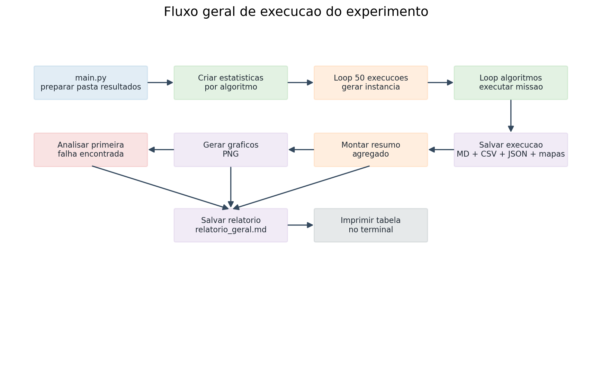
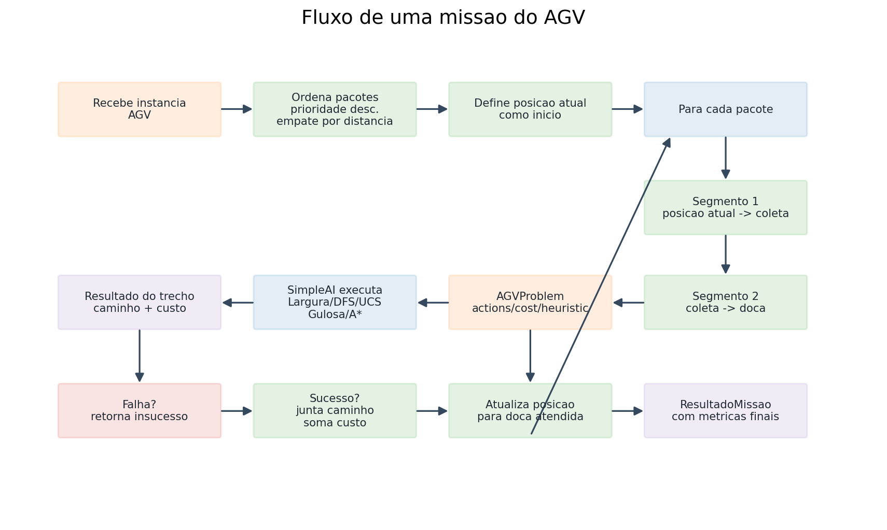
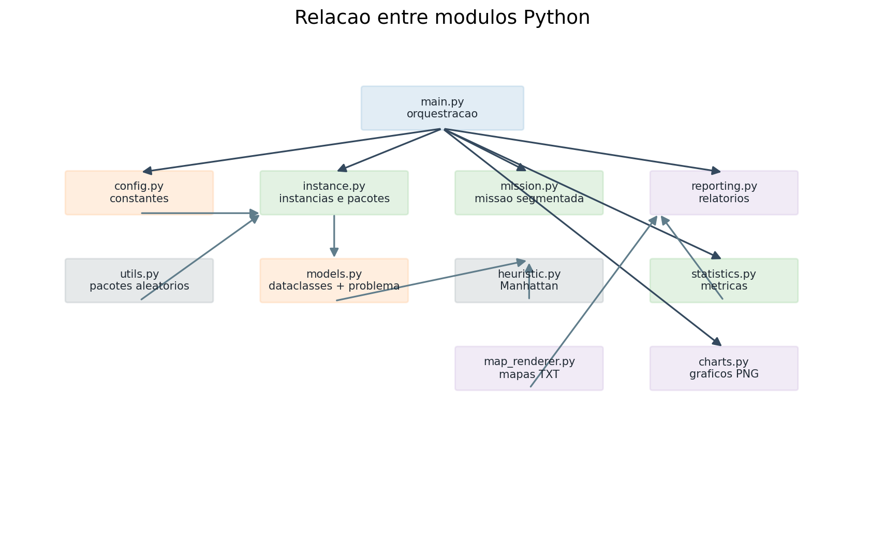

# Analise geral do codigo

Este documento descreve o projeto Python de planejamento de rotas para AGVs. O codigo executa experimentos em um grid, gera instancias aleatorias de armazem, compara algoritmos de busca da biblioteca SimpleAI e salva resultados em arquivos CSV, JSON, Markdown, TXT e PNG.

## Diagramas

### Fluxo geral da execucao



### Fluxo de uma missao do AGV



### Relacao entre modulos



## O que o codigo faz

O sistema simula um AGV em um centro de distribuicao representado por um grid `50x50`. Em cada execucao, ele cria uma instancia aleatoria contendo:

- uma posicao inicial do AGV;
- um ponto de coleta;
- quatro docas fixas;
- 300 obstaculos intransponiveis;
- 200 zonas de congestionamento com custo maior;
- 3 pacotes, cada um com doca de destino e prioridade.

Para cada instancia, o programa executa cinco algoritmos de busca:

- Busca em Largura;
- Busca em Profundidade;
- Busca de Custo Uniforme;
- Busca Gulosa;
- A*.

A missao nao e resolvida como uma unica busca global. Ela e dividida em segmentos. Para cada pacote ordenado por prioridade, o AGV primeiro vai da posicao atual ate o ponto de coleta e depois vai do ponto de coleta ate a doca do pacote. Ao terminar uma entrega, a posicao atual passa a ser a doca atendida.

O custo de movimento e:

- `1` para celulas normais;
- `10` para celulas em zonas de congestionamento;
- impossivel atravessar obstaculos.

Ao final, o sistema consolida os resultados, gera tabelas, graficos, mapas textuais e um relatorio geral em `resultados/relatorio_geral.md`.

## Arquivos Python

### `main.py`

Arquivo de entrada do projeto. Ele orquestra todo o experimento.

Funcao `main()`:

- prepara a pasta `resultados`;
- inicializa a estrutura de estatisticas para cada algoritmo;
- executa `N_EXECUCOES`, atualmente `50`;
- em cada execucao, gera uma instancia aleatoria com `gerar_instancia_aleatoria`;
- executa cada algoritmo registrado em `ALGORITMOS`;
- registra os resultados agregados;
- salva os resultados individuais da execucao;
- monta o resumo geral;
- salva `resumo_geral.csv`;
- gera graficos PNG;
- procura a primeira falha;
- se houver falha, gera um mapa textual especifico dela;
- salva o relatorio geral em Markdown;
- imprime a tabela final no terminal.

O bloco:

```python
if __name__ == "__main__":
    main()
```

permite executar o projeto diretamente com `python main.py`.

### `src/config.py`

Centraliza as constantes de configuracao do experimento.

Elementos principais:

- `ALGORITMOS`: lista de pares `(nome, funcao)` com as buscas importadas de `simpleai.search`;
- `RESULTADOS_DIR`: pasta onde os resultados sao salvos;
- `N_PACOTES`: quantidade de pacotes por instancia;
- `N_EXECUCOES`: quantidade total de execucoes;
- `GRID_SIZE`: tamanho do mapa;
- `DOCAS`: posicoes fixas das docas;
- `N_OBSTACULOS`: quantidade de obstaculos aleatorios;
- `N_CONGESTIONAMENTOS`: quantidade de celulas congestionadas.

Esse arquivo define o comportamento global da simulacao. Alterar esses valores muda a escala do experimento.

### `src/models.py`

Define os tipos de dados centrais e o problema de busca usado pela SimpleAI.

Tipo `Posicao`:

- alias para `tuple[int, int]`;
- representa uma coordenada `(x, y)` no grid.

Classe `InstanciaAGV`:

- dataclass imutavel com os dados de uma instancia;
- armazena execucao, inicio, coleta, docas, obstaculos, congestionamentos e pacotes.

Classe `ResultadoMissao`:

- dataclass mutavel com o resultado de uma missao;
- guarda sucesso ou falha, custo, tempo, caminho, pacotes, distancia percorrida, segmentos resolvidos, segmento de falha e erro.

Classe `AGVProblem(SearchProblem)`:

- adapta o problema de rota do AGV para a interface da biblioteca SimpleAI;
- recebe inicio, destino, obstaculos, congestionamentos e tamanho do grid.

Metodos de `AGVProblem`:

- `__init__`: configura o estado inicial, objetivo e restricoes do grid;
- `actions(state)`: retorna movimentos validos para cima, baixo, direita e esquerda, removendo posicoes fora do grid ou em obstaculos;
- `result(state, action)`: retorna o proprio estado de destino da acao;
- `is_goal(state)`: verifica se o estado atual e o objetivo;
- `cost(state, action, state2)`: retorna `10` se o destino estiver congestionado, senao `1`;
- `heuristic(state)`: calcula distancia de Manhattan ate o objetivo;
- `_inside_grid(pos)`: valida se uma posicao esta dentro dos limites do grid.

### `src/heuristic.py`

Contem a heuristica usada por buscas informadas.

Funcao `manhattan(a, b)`:

- calcula `abs(a[0] - b[0]) + abs(a[1] - b[1])`;
- estima a distancia entre duas posicoes em um grid com movimento ortogonal;
- e usada por `AGVProblem.heuristic` e tambem para desempatar a ordenacao dos pacotes.

### `src/instance.py`

Responsavel por gerar instancias aleatorias e ordenar pacotes.

Funcao `gerar_posicao_livre(grid_size, proibidas)`:

- sorteia posicoes ate encontrar uma coordenada que nao esteja no conjunto `proibidas`;
- e usada para criar inicio, coleta, obstaculos e congestionamentos.

Funcao `gerar_conjunto_aleatorio(quantidade, grid_size, proibidas)`:

- cria um conjunto com `quantidade` posicoes livres;
- evita repetir posicoes e evita celulas proibidas.

Funcao `gerar_instancia_aleatoria(id_execucao)`:

- cria uma instancia completa para uma execucao;
- mantem docas fixas;
- sorteia inicio e coleta;
- sorteia obstaculos;
- sorteia congestionamentos fora dos obstaculos;
- cria pacotes aleatorios;
- retorna uma `InstanciaAGV`.

Funcao `ordenar_pacotes(pacotes, ponto_coleta)`:

- ordena primeiro por prioridade decrescente;
- em caso de empate, usa a distancia de Manhattan entre a doca do pacote e o ponto de coleta;
- retorna uma nova lista ordenada.

### `src/utils.py`

Modulo de utilidades gerais.

Funcao `gerar_pacotes_aleatorios(quantidade, docas)`:

- cria uma lista de dicionarios;
- cada pacote recebe `id`, `doca` escolhida aleatoriamente e prioridade `prio` entre 1 e 3.

Funcao `formatar_posicao(pos)`:

- formata uma posicao como texto no padrao `(x, y)`;
- atualmente nao e usada pelos demais modulos.

### `src/mission.py`

Executa a missao completa do AGV usando um algoritmo de busca.

Funcao `extrair_caminho(resultado)`:

- recebe o resultado retornado pela SimpleAI;
- extrai apenas os estados do caminho;
- ignora os nomes das acoes.

Funcao `juntar_caminho(caminho_total, trecho)`:

- concatena um novo trecho ao caminho acumulado;
- remove o primeiro ponto do trecho quando ja existe caminho anterior, evitando duplicar a posicao de emenda.

Funcao `executar_segmento(instancia, algoritmo, origem, destino)`:

- cria um `AGVProblem` para um par origem-destino;
- executa o algoritmo informado com `graph_search=True`;
- retorna o resultado da busca.

Funcao `executar_missao(instancia, nome_algoritmo, algoritmo)`:

- ordena os pacotes;
- inicia na posicao inicial do AGV;
- para cada pacote, resolve dois segmentos:
  - posicao atual ate coleta;
  - coleta ate doca do pacote;
- soma os custos retornados por cada segmento;
- une os caminhos parciais;
- mede o tempo total com `time.perf_counter`;
- retorna `ResultadoMissao` com sucesso quando todos os segmentos sao resolvidos;
- retorna `ResultadoMissao` com falha quando algum segmento nao encontra caminho;
- captura excecoes e registra o erro em `ResultadoMissao.erro`.

### `src/statistics.py`

Agrupa, resume e imprime metricas dos algoritmos.

Funcao `criar_estatisticas(algoritmos)`:

- cria um dicionario por algoritmo;
- cada algoritmo recebe listas de custos, tempos, contador de sucessos e contador de falhas.

Funcao `registrar_resultado(estatisticas, resultado)`:

- se a missao teve sucesso, adiciona custo e tempo e incrementa sucessos;
- se falhou, incrementa falhas.

Funcao `resumir_estatisticas(estatisticas)`:

- calcula custo medio, minimo e maximo;
- calcula tempo medio, minimo e maximo;
- preserva contagens de sucesso e falha;
- retorna uma lista de dicionarios pronta para CSV, relatorio e graficos.

Funcao `imprimir_tabela(resumo)`:

- imprime no terminal uma tabela formatada com os resultados agregados.

### `src/charts.py`

Gera graficos PNG usando Matplotlib no backend `Agg`, adequado para execucao sem interface grafica.

Funcao `_linhas_com_valor(resumo, chave)`:

- filtra linhas do resumo onde a chave informada nao e `None`;
- evita plotar valores inexistentes.

Funcao `gerar_graficos(resumo, resultados_por_execucao, pasta_graficos)`:

- cria a pasta de graficos;
- gera grafico de custo medio;
- gera grafico de tempo medio;
- gera grafico de falhas;
- gera grafico de custo por execucao;
- retorna um dicionario com os caminhos dos arquivos gerados.

Funcao `_grafico_barras(linhas, chave, titulo, eixo_y, arquivo)`:

- cria um grafico de barras;
- usa nomes dos algoritmos no eixo X;
- salva o arquivo PNG.

Funcao `_grafico_linhas_custo(resultados_por_execucao, arquivo)`:

- agrupa resultados bem-sucedidos por algoritmo;
- ordena pontos por numero de execucao;
- plota o custo total de cada algoritmo ao longo das execucoes;
- salva o arquivo PNG.

### `src/map_renderer.py`

Gera mapas textuais do grid e da rota encontrada.

Funcao `simbolo_seta(origem, destino)`:

- compara duas posicoes consecutivas;
- retorna `v`, `^`, `>` ou `<` conforme a direcao do movimento;
- retorna `.` se nao houver deslocamento reconhecido.

Funcao `linhas_mapa(instancia, caminho)`:

- constroi as linhas textuais do grid;
- marca inicio com `S`;
- marca coleta com `C`;
- marca docas com `D`;
- marca destino final com `G` ou `DG` quando o fim tambem e uma doca;
- marca obstaculos com `X`;
- marca congestionamentos com `~`;
- marca a rota com setas;
- usa largura fixa por celula para melhorar a leitura.

Funcao `gerar_mapa_txt(instancia, caminho, arquivo)`:

- escreve legenda, dados da instancia, pacotes ordenados e mapa final em um arquivo `.txt`.

### `src/reporting.py`

Responsavel por persistir resultados e gerar relatorios.

Funcao `preparar_pasta_resultados(pasta)`:

- cria a pasta principal de resultados;
- cria a subpasta `graficos`.

Funcao `salvar_resultados_execucao(pasta_execucao, instancia, resultados)`:

- cria a pasta da execucao;
- salva a instancia em Markdown;
- salva resultados em CSV;
- salva resultados em JSON;
- gera mapas textuais para resultados bem-sucedidos ou falhas com segmento identificado.

Funcao `salvar_instancia_markdown(arquivo, instancia)`:

- salva dados basicos da instancia;
- lista inicio, coleta, docas, quantidade de obstaculos e congestionamentos;
- inclui a tabela dos pacotes ordenados.

Funcao `salvar_resultados_csv(arquivo, resultados)`:

- salva os resultados de uma execucao em CSV.

Funcao `salvar_resultados_json(arquivo, resultados)`:

- salva os resultados de uma execucao em JSON.

Funcao `campos_resultado()`:

- define a ordem e os nomes das colunas usadas nos arquivos de resultado.

Funcao `linha_resultado(resultado)`:

- converte um `ResultadoMissao` em dicionario serializavel;
- troca valores `None` por string vazia quando necessario.

Funcao `salvar_resumo_csv(arquivo, resumo)`:

- salva o resumo agregado em CSV.

Funcao `salvar_relatorio_markdown(arquivo, resumo, graficos, falha_analisada, total_execucoes)`:

- cria o relatorio geral em Markdown;
- inclui tabela agregada;
- referencia os graficos PNG;
- inclui a analise da primeira falha, se houver;
- quando nao existe falha, registra que todos os algoritmos encontraram rota nos testes.

Funcao `encontrar_primeira_falha(instancias, resultados)`:

- percorre os resultados;
- retorna a primeira combinacao de instancia e resultado com `sucesso=False`;
- retorna `None` se nao houver falha.

Funcao `montar_resumo(estatisticas)`:

- delega para `resumir_estatisticas`;
- existe como camada de conveniencia para o modulo de relatorios.

Funcao `_fmt(valor, casas=2)`:

- formata numeros para o relatorio;
- retorna `--` quando o valor e `None`.

### `src/__init_.py`

Arquivo vazio. Ele nao contem funcoes nem classes.

Observacao: o nome esta como `__init_.py`, com apenas um underscore no final. O nome convencional de pacote Python e `__init__.py`. Mesmo assim, o projeto pode funcionar em Python moderno porque `src` pode ser tratado como namespace package, mas o nome atual nao cumpre a convencao tradicional.

## Fluxo de dados

1. `main.py` le configuracoes de `src/config.py`.
2. `src/instance.py` gera a instancia aleatoria.
3. `src/utils.py` cria os pacotes.
4. `src/mission.py` ordena os pacotes e cria problemas de busca por segmento.
5. `src/models.py` define como a SimpleAI navega no grid.
6. A SimpleAI executa o algoritmo escolhido.
7. `src/statistics.py` registra sucesso, falha, custo e tempo.
8. `src/reporting.py` salva arquivos por execucao e relatorio geral.
9. `src/charts.py` gera graficos.
10. `src/map_renderer.py` gera mapas textuais.

## Artefatos gerados

Durante a execucao, o projeto grava arquivos dentro de `resultados/`:

- `resumo_geral.csv`: resumo agregado por algoritmo;
- `relatorio_geral.md`: relatorio Markdown final;
- `graficos/*.png`: graficos comparativos;
- `execucao_XXX/instancia.md`: detalhes da instancia;
- `execucao_XXX/resultados.csv`: resultados da execucao;
- `execucao_XXX/resultados.json`: resultados da execucao em JSON;
- `execucao_XXX/mapa_<Algoritmo>.txt`: mapa textual com rota;
- `execucao_XXX/mapa_falha_<Algoritmo>.txt`: mapa adicional para a primeira falha analisada.

## Observacoes tecnicas

- O README menciona alguns conceitos que nao aparecem na implementacao atual, como grid `80x80`, terrenos `F`, `L`, bloqueio `B` e custos por terreno. O codigo atual usa grid `50x50`, obstaculos `X`, congestionamento `~` e custo `10` para congestionamento.
- A ordenacao de pacotes implementada considera prioridade e distancia da doca ao ponto de coleta. O README menciona desempate pela posicao atual do AGV e identificador do pacote, mas isso nao esta no codigo atual.
- A busca em profundidade pode encontrar caminhos de custo alto, pois nao otimiza custo. Custo uniforme e A* tendem a ser mais adequados quando o custo de congestionamento importa.
- Como as instancias sao aleatorias e nao ha semente fixa de `random`, os resultados podem variar a cada execucao.
